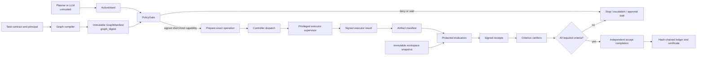
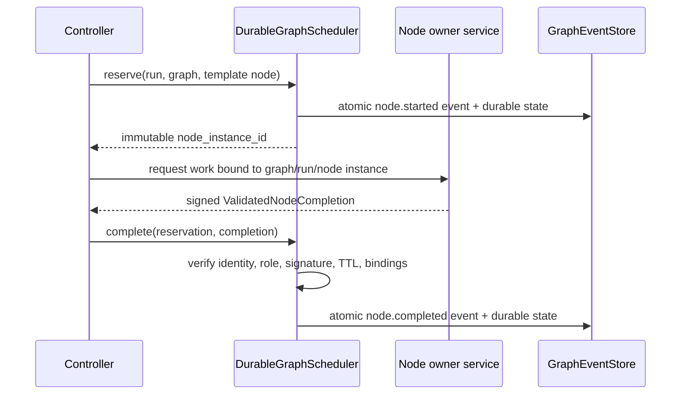
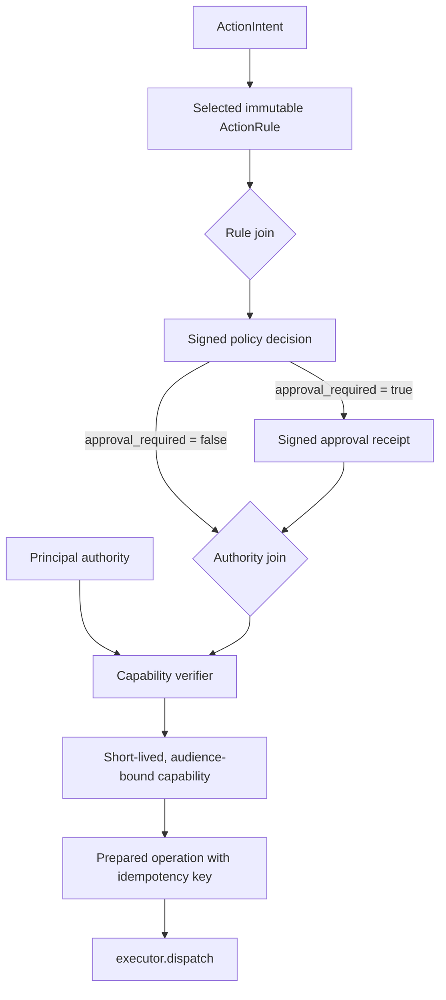
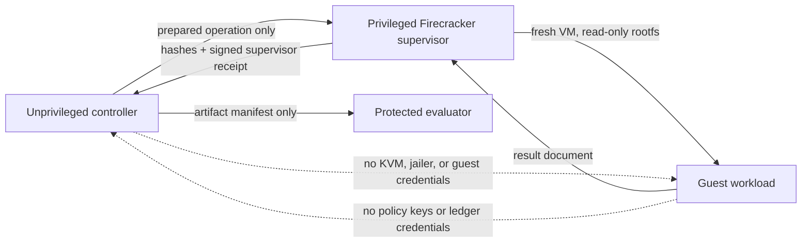
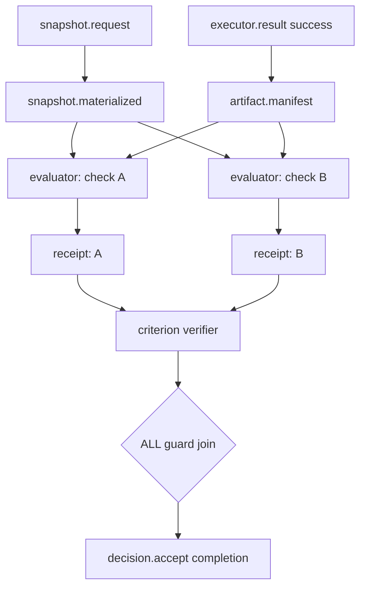
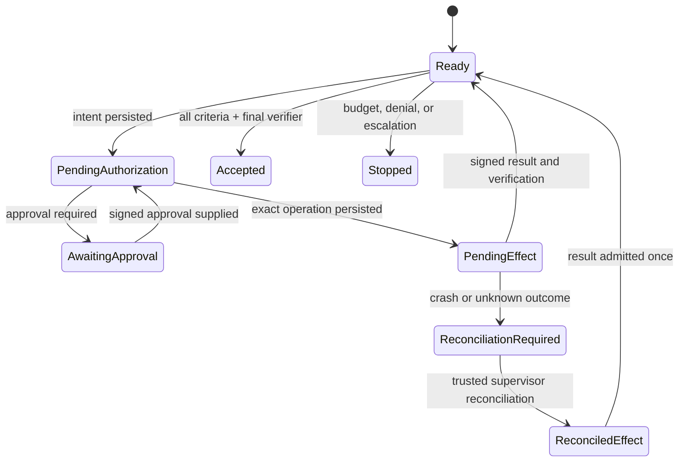
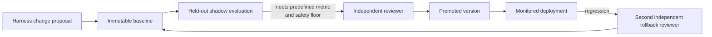
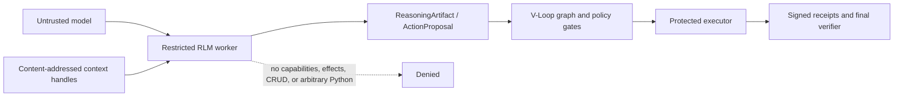

# V-Loop [![zread](https://img.shields.io/badge/Ask_Zread-_.svg?style=for-the-badge&color=00b0aa&labelColor=000000&logo=data%3Aimage%2Fsvg%2Bxml%3Bbase64%2CPHN2ZyB3aWR0aD0iMTYiIGhlaWdodD0iMTYiIHZpZXdCb3g9IjAgMCAxNiAxNiIgZmlsbD0ibm9uZSIgeG1sbnM9Imh0dHA6Ly93d3cudzMub3JnLzIwMDAvc3ZnIj4KPHBhdGggZD0iTTQuOTYxNTYgMS42MDAxSDIuMjQxNTZDMS44ODgxIDEuNjAwMSAxLjYwMTU2IDEuODg2NjQgMS42MDE1NiAyLjI0MDFWNC45NjAxQzEuNjAxNTYgNS4zMTM1NiAxLjg4ODEgNS42MDAxIDIuMjQxNTYgNS42MDAxSDQuOTYxNTZDNS4zMTUwMiA1LjYwMDEgNS42MDE1NiA1LjMxMzU2IDUuNjAxNTYgNC45NjAxVjIuMjQwMUM1LjYwMTU2IDEuODg2NjQgNS4zMTUwMiAxLjYwMDEgNC45NjE1NiAxLjYwMDFaIiBmaWxsPSIjZmZmIi8%2BCjxwYXRoIGQ9Ik00Ljk2MTU2IDEwLjM5OTlIMi4yNDE1NkMxLjg4ODEgMTAuMzk5OSAxLjYwMTU2IDEwLjY4NjQgMS42MDE1NiAxMS4wMzk5VjEzLjc1OTlDMS42MDE1NiAxNC4xMTM0IDEuODg4MSAxNC4zOTk5IDIuMjQxNTYgMTQuMzk5OUg0Ljk2MTU2QzUuMzE1MDIgMTQuMzk5OSA1LjYwMTU2IDE0LjExMzQgNS42MDE1NiAxMy43NTk5VjExLjAzOTlDNS42MDE1NiAxMC42ODY0IDUuMzE1MDIgMTAuMzk5OSA0Ljk2MTU2IDEwLjM5OTlaIiBmaWxsPSIjZmZmIi8%2BCjxwYXRoIGQ9Ik0xMy43NTg0IDEuNjAwMUgxMS4wMzg0QzEwLjY4NSAxLjYwMDEgMTAuMzk4NCAxLjg4NjY0IDEwLjM5ODQgMi4yNDAxVjQuOTYwMUMxMC4zOTg0IDUuMzEzNTYgMTAuNjg1IDUuNjAwMSAxMS4wMzg0IDUuNjAwMUgxMy43NTg0QzE0LjExMTkgNS42MDAxIDE0LjM5ODQgNS4zMTM1NiAxNC4zOTg0IDQuOTYwMVYyLjI0MDFDMTQuMzk4NCAxLjg4NjY0IDE0LjExMTkgMS42MDAxIDEzLjc1ODQgMS42MDAxWiIgZmlsbD0iI2ZmZiIvPgo8cGF0aCBkPSJNNCAxMkwxMiA0TDQgMTJaIiBmaWxsPSIjZmZmIi8%2BCjxwYXRoIGQ9Ik00IDEyTDEyIDQiIHN0cm9rZT0iI2ZmZiIgc3Ryb2tlLXdpZHRoPSIxLjUiIHN0cm9rZS1saW5lY2FwPSJyb3VuZCIvPgo8L3N2Zz4K&logoColor=ffffff)](https://zread.ai/dino65-dev/v-loop)

V-Loop is a Verified Adaptive Loop Agent. The V0 implementation keeps the
model outside the trusted computing base:

    planner -> ActionIntent -> PolicyGate -> short-lived Capability -> Executor
                                                    |                  |
                                                    +---- Ledger <-----+
                                                           |
                                                       Verifiers
                                                           |
                                                 accept | repair | stop

The controller may propose an action, but only the deterministic policy gate
can authorize it and only independently recorded evidence can satisfy a task.

## Package map

The public Python surface is organized by trust boundary. Existing flat-module
imports remain compatible; new integrations should use these namespaces.

```text
vloop/
├── control/        contracts, capabilities, policy, controller, runtime, checkpoints
├── evidence/       attestations, snapshots, receipts, ledger, certificates
├── execution/      executor adapters, Firecracker boundary, supervisor client
├── intelligence/   untrusted planning, context, memory, probes, repair, shadow model
├── governance/     harness experiments, promotion, rollback, delegation
├── graph*.py       typed graph compiler, monitor, scheduler, formal model
├── models.py       immutable shared domain models
└── canonical.py    canonical JSON and SHA-256 primitives
```

The namespaces are an import and ownership boundary, not a claim that all code
inside a process is isolated. The production deployment boundaries remain the
separate policy, supervisor, evaluator, and ledger services.

## Architecture: how a run actually works

V-Loop is deliberately not an autonomous shell wrapper. It is a control plane
for a bounded task: the model may propose an `ActionIntent`, but it cannot
issue a capability, complete an externally owned graph node, accept a run, or
write the evidence ledger directly.



The compiler produces a versioned `GraphManifest`. Its SHA-256
`graph_digest` is carried through the capability, prepared operation,
supervisor/evaluator requests, receipts, checkpoint, and final certificate.
This makes a proof for one graph or run unusable for another.

### 1. Graph scheduler: reserve, then prove completion

The controller is the only component that advances the graph, but it is not
trusted to manufacture results from services it does not own. A remote-owned
node must first be reserved. Its owner then returns a signed
`ValidatedNodeCompletion` for that exact reservation; only then can the
scheduler commit the node and causal event.



Every completion binds the graph digest, contract digest, run ID, template
node ID, realized node-instance ID, producer role, artifact digest, ownership
policy digest, result, nonce, issue/expiry time, and authority/evidence
references. The monitor rejects a direct completion for an externally owned
node, a completion without a reservation, a replayed instance, expired work,
the wrong workload role, or a completion for a different graph/run.

The state machine also makes dependencies executable. A downstream transition
checks facts emitted by its already-completed predecessor. In particular,
`execution.success` reads the authenticated executor result; a target payload
cannot claim success to unlock itself.

### 2. Authorization and dynamic approval



`PolicyGate` is deterministic and default-deny. It matches the requested
tool, effect, target, typed arguments, contract version, provenance DAG,
budget, expiry, and approval requirements before minting a short-lived,
Ed25519-signed capability for one executor audience. Executor-side verification
and durable nonce/idempotency stores enforce that capability immediately before
the effect. The graph records a separate policy-decision node and uses its
runtime `approval_required` fact to select the direct or approved path.

This is important: an LLM may recommend an action, but it has no signing key,
approval authority, KVM access, evaluator authority, or ledger-write
permission.

### 3. Untrusted execution boundary



The production design places untrusted code behind a separately deployed
Firecracker supervisor. The controller supplies a capability-bound prepared
operation; the supervisor owns KVM/jailer access, creates a fresh writable job
drive, uses a read-only root filesystem, and returns a signed lifecycle/result
receipt after teardown. An unknown in-flight outcome is reconciled, never
blindly replayed.

`LocalCommandExecutor`, local callbacks, and `DevelopmentCompletionFabric` are
explicit development facilities. They are not an isolation or independence
claim. Production construction requires external completion clients/verifiers
and rejects metadata-only substitutes.

### 4. Snapshot, evaluator, receipt, and acceptance path



Each protected evaluation plan is compiled into a concrete evaluator and
receipt node before the run starts. The evaluator receives the exact graph
digest, evaluator node ID, and reservation instance ID. `SignedReceiptVerifier`
accepts a receipt only when the receipt’s run, intent, contract, artifact
manifest, workspace snapshot, evaluator policy, graph digest, node ID, and
node instance all match. A valid receipt copied from another run, graph, or
evaluator node is rejected.

Final acceptance is not a model judgment and not merely an action-level pass.
The final verifier binds every contractual success condition to named hard
checks. The graph’s criterion nodes require receipts for those conditions, the
join is `ALL`, and `decision.accept` is itself an externally owned signed
completion. Multi-step tasks preserve earlier passing evidence rather than
letting a later unrelated inconclusive check erase it.

### 5. Durable recovery and proof



The checkpoint, graph state, and causal events are durable SQLite state. A
certificate replays the stored trace through the same graph monitor, including
the reservation/completion lifecycle, then verifies causal-parent closure,
trace root, realized node IDs, terminal decision, and certificate signature.
`WorkspaceTransition` also cryptographically covers its outer parent/output
snapshots, operation, changed paths, manifest, and supervisor receipt, so an
attacker cannot swap those fields around an otherwise valid inner artifact.

### 6. Governed harness evolution



`DynamicSubgraphPolicy` can admit only contract-bound, acyclic, read-only
analysis subgraphs; it cannot introduce an authority-bearing node. Changes to
context, retrieval, evaluator, probes, routing, memory, and repair components
go through governed harness proposals with a baseline, held-out evidence,
independent promotion, and protected rollback.

## Security posture and limits

V-Loop provides strong *control-plane* safeguards when deployed with the
separate authorities described above. It does not turn an arbitrary model or
host into a trusted environment by itself.

| Threat or failure | Enforced mitigation | Remaining deployment assumption |
| --- | --- | --- |
| Model proposes a dangerous action | Closed contract, policy gate, capability, approvals, provenance validation | The server-owned contract and policy configuration are correct |
| Controller fabricates evaluator/executor success | Reservation-bound signed completions and exclusive node roles | Completion signers and identity issuer are protected |
| Replay/cross-run receipt reuse | Graph/contract/run/node-instance/artifact binding and nonce/TTL validation | Durable stores and clock source are reliable |
| Crash during a side effect | Durable prepared operation and reconciliation-only recovery | Supervisor/reconciler correctly reports the real remote outcome |
| Untrusted code escapes the controller boundary | Firecracker supervisor separation, read-only rootfs, fresh job drive | Host, Firecracker, jailer, kernel, and VM image are hardened and patched |
| Forged or substituted evidence | Signed receipts, canonical artifacts/snapshots, hash-chained ledger, certificate replay | Trusted keys, revocation data, and remote services are operated securely |
| Prompt injection/retrieval taint | Per-argument provenance DAG, untrusted-data propagation, deterministic policy | The provenance source labeling is complete |
| Neural verifier says “accept” | Shadow-only diagnostics; no authority over policy, acceptance, execution, or memory | Operators do not wire advisory output into privileged paths |

For a high-assurance deployment, use distinct workload identities for policy,
approval, executor supervisor, snapshotter, each evaluator, receipt verifier,
criterion verifier, ledger anchor, and execution-certificate signer; keep
private keys outside the controller; use authenticated service-to-service
transport; enforce key validity and revocation; pin VM/evaluator artifacts; and
independently monitor durable storage, clocks, and the host/VM boundary.

## What is implemented

- versioned task contracts and per-action budgets;
- default-deny reference monitor, restrictive overlapping rules, and
  Ed25519-signed, audience-bound executor capabilities, typed argument
  semantics, and argument-level provenance;
- executor-side one-time nonce consumption and lease-aware idempotency state;
- hash-chained SQLite evidence ledger with a transactional singleton head;
- structured pass/fail/inconclusive verifier results and deterministic
  acceptance rules, plus an explicit final-goal receipt before acceptance;
- L0 structural validation, phased verifier execution, and signed evaluator
  receipts bound to run, intent, contract, canonical artifact manifest, primary
  artifact, evaluator policy, and signed workspace/toolchain state;
- explicit development and production runtime recipes; production startup
  rejects metadata-only verifiers, missing durable stores, unsigned approvals,
  missing probe policy, or an unsigned Firecracker supervisor;
- failure diagnosis, retry de-duplication, and terminal budget handling;
- evidence-bound memory-record schema and promotion gate;
- canonical verified-memory ledger, L0 working-state store, scoped retrieval,
  and pluggable hot/associative index adapters;
- fail-closed Bubblewrap executor interface and a development-only local
  command executor;
- Firecracker microVM launch contracts, supervisor-signed lifecycle receipts,
  and Firecracker isolation/benchmark evidence verifiers;
- advisory neural-verifier diagnostics in shadow mode, recorded separately
  from deterministic verification results;
- deterministic repair directives that consume neural output as advice only;
- bounded adversarial probes registered and executed only by protected
  evaluator code;
- specialist dispatcher requiring prior verified same-budget improvement,
  server-side role registration, and a fixed total budget;
- offline trace sanitization and model promotion gates for shadow, canary, and
  production rollout;
- authority-bounded task-contract compilation from server-owned tool catalogs;
- context and state packaging with bounded retrieval, environment fingerprints,
  and explicit untrusted-data provenance;
- signed, expiring approval receipts plus a `waiting` terminal state for work
  that requires an external reviewer;
- optional OpenAI-compatible planner wiring for the configured BazaarLink
  endpoint and DeepSeek model.
- a deterministic typed Graph IR that compiles control, authority,
  snapshot/artifact, evaluator, receipt, criterion, recovery, and decision
  paths, with graph-digest binding for runs, capabilities, prepared operations,
  supervisor execution specifications, and protected evaluator receipts;
- static graph checks for reachability, dead ends, capability and approval
  paths, guard dominance, bounded cycle exit, recovery coverage, untrusted
  provenance influence, memory-authority monotonicity, and human-control exits;
- server-owned admission for bounded, acyclic, read-only dynamic reasoning
  subgraphs, plus durable governed harness evolution and model-controlled
  topology benchmark summaries.

## Safety boundary

LocalCommandExecutor is development-only; it is not an isolation boundary.
Production actions must place every raw executor behind
`CapabilityEnforcingExecutor`. The policy service retains the Ed25519 private
key; the executor holds only the public verification key plus a durable nonce
and idempotency store. It verifies audience, expiry, exact intent binding and
signature immediately before the side effect. A stale in-flight reservation is
made `indeterminate`, never replayed after a crash. Raw executors are not
policy enforcement points and must not be exposed to untrusted callers.

`DevelopmentRuntime` may use local callbacks and metadata checks. It is
intentionally not production-safe. `ProductionRuntimeBuilder.validate()` is the
required deployment gate: it requires a `CapabilityEnforcingExecutor` over a
Firecracker executor, SQLite nonce/idempotency/policy-budget stores,
policy-bound schema-v2 signed receipts for every contract-required verifier,
`StructuralVerifier`, a final verifier, non-empty protected probes, a signed
approval verifier, a policy-bound Firecracker supervisor receipt, durable
SQLite controller state, and authenticated remote supervisor/ledger-anchor
clients. Production contracts must use closed argument schemas and require a
value-bound provenance DAG for every argument.
`build()` returns an immutable `ProductionRuntime`, not the builder itself.
The runtime re-validates the contract digest, verifier requirements, closed
argument schemas, key trust, and receipt policies before constructing a loop,
so later mutation of a component cannot silently broaden the deployed gate.

Use BubblewrapExecutor (or another separately deployed executor) with separate
credentials, read-only evaluator assets, constrained mounts, no network unless
explicitly required, and no direct ledger access.

For untrusted code, use FirecrackerExecutor with a privileged supervisor
service. The microVM rootfs is read-only, each job receives a new writable job
drive, and V0 disables network access. The rootfs must contain a guest agent
that reads the host-created manifest and writes a result document. Do not use
host shell commands or SSH keys as the guest-control plane.

`FirecrackerPreflight` checks the deployer-owned Firecracker/jailer binaries,
writable jailer chroot, guest assets, and usable `/dev/kvm` before deployment.
`FirecrackerSupervisorPlan` produces a shell-free jailer launch request, but
does not start a VM: a separately privileged supervisor must materialize the
manifest/config, prepare a fresh job drive, manage VM lifecycle, hash the
result after shutdown, destroy the drive, and return a signed supervisor
receipt. The production runtime always configures this verifier; it rejects a
result unless the receipt binds the run, intent, contract, complete artifact
manifest and primary artifact, job/manifest, fresh drive, and destruction
attestation. This is intentional; the controller never holds KVM or jailer
authority.

The repository provides narrow signed HTTPS clients and durable outboxes for a
privileged Firecracker supervisor, protected evaluator, and external ledger
anchor. It does not provide or operate those privileged services: deployment
must run them with distinct credentials, deduplicate the supplied job/head ID,
and sign the separately trusted receipts. The production builder rejects an
in-process supervisor or absent remote-service client.

`CanonicalWorkspaceSnapshotter` creates deterministic, schema-versioned
workspace snapshots that bind the source tree, dependency-lock digests,
toolchain, environment, Git state, and an explicit exclusion policy. Production
receipts use this snapshot rather than a caller-supplied source digest. The
deployment must snapshot an immutable copy or read-only mount; a snapshotter
cannot itself prevent a source tree from changing after it has been read.

## Quick start

    uv run --extra dev pytest
    uv run python -m vloop.demo

### Optional Rust trusted kernel

The Python package remains the stable public API. On Linux x86_64, install the
optional `vloop-native` companion to route canonical-byte hashing and all
Ed25519 capability, approval, receipt, artifact, completion, and certificate
signatures through the Rust kernel:

    uv sync --extra rust --extra dev
    VLOOP_NATIVE_BACKEND=required uv run pytest

`VLOOP_NATIVE_BACKEND=auto` (the default) uses Rust when present and retains
the compatible Python implementation only when the optional extension is not
installed. `off` forces Python for differential testing; `required` fails
closed if the native module is unavailable or has an incompatible API version.
The native workspace is intentionally narrow: it handles deterministic bytes
and cryptography, while Python retains the controller, model integrations,
service clients, Firecracker orchestration, and user-provided verifiers.

The optional model planner needs a secret outside the repository:

    export VLOOP_API_KEY='...'
    export VLOOP_MODEL='deepseek/deepseek-v4-flash'
    export VLOOP_MODEL_BASE_URL='https://bazaarlink.ai/api/v1'

The planner receives no authority from this configuration. Every parsed model
proposal still passes through the contract and policy gate.

## Final-goal verification

Every `VerifiedLoop` run now requires an explicit `FinalVerifier` before it can
return `accept`. The controller accumulates action evidence over the whole run.
`RequiredChecksFinalVerifier` binds each immutable success condition to named
protected checks and accepts only checks fresh for the final signed
workspace-state digest; a check from before the final source change cannot
satisfy completion. Later valid results supersede earlier ones, while a tied
contradiction remains inconclusive. Guest-provided `source_state_digest`
metadata is never used for final completion.
Production systems can instead supply a separate end-to-end evaluator. A
passing action report or neural diagnostic alone is never enough to complete a
task.

An action report may still make safe criterion progress when its structural and
hard checks pass but other task criteria are incomplete. This lets multi-step
tasks accumulate independent evidence without treating an incomplete action as
globally accepted; any failed hard check remains a repair path.

## Neural verifier

ShadowNeuralVerifier sends a redacted diagnostic packet to a configured model
and records only its structured output. It cannot accept a result, choose a
repair, write memory, or authorize a tool. Run the bounded live smoke test with:

    VLOOP_API_KEY='...' uv run --extra model python -m vloop.model_smoke

If the secret already exists under a differently named environment variable,
do not copy it into source code. Point V-Loop to that name for the current
process instead:

    VLOOP_API_KEY_ENV='existing_secret_variable_name' uv run --extra model python -m vloop.model_smoke

## Repair and delegation

RepairController maps hard verification categories to local repair, probing,
replanning, or escalation. The neural verifier may add evidence gaps and a
suggested stage, but cannot change that mapping. DelegationGate stays disabled
unless a recorded experiment shows a specialist beats the single-agent baseline
under the required total budget. When enabled, SpecialistDispatcher can call
only deployment-registered roles, supplies no credentials or capabilities, and
records output digests rather than raw specialist text.

ProtectedProbeRunner is the active verifier-side probe layer. It selects only
pre-registered edge-case, mutation, counterexample, or consistency probes from
hard-check categories. When configured, it also runs before acceptance and its
failure or uncertainty becomes authoritative verifier evidence. The planner
cannot provide executable probe code.

## Offline improvement

TraceDatasetBuilder exports only independently verified, sanitized run traces.
An accepted trace additionally needs a `final-goal.completed` receipt with a
passing status. Probe and context receipts are retained as labelled evidence,
not as model authority.
ModelPromotionGate requires multiple cross-domain evaluation slices with bounded
false-allow and prompt-injection escape rates before a candidate moves from
offline to shadow, shadow to canary, or canary to production. A failed safety
rate triggers rollback rather than a further self-update.

## Task contracts

TaskContractCompiler accepts requested actions only when they are a strict
subset of the server-owned ToolAuthority catalog. A model may draft the
request, but cannot broaden a path, remove an approval requirement, or modify
the forbidden-action list.

For deployment, construct the compiler from a server-owned `TaskProfile`.
Profiles bind a task kind to tool authorities, required verifier categories,
named check bindings for every success condition, probe policy, risk class,
and the mandatory per-argument provenance requirement.
This makes the generated contract suitable for the production runtime gate;
the client request may only select a subset of those predeclared conditions.

## Approval and key trust

High-impact actions use signed approvals bound to the exact intent digest,
contract digest, and executor identity. Approval verification uses a
verifier-owned approver trust entry with role, validity, and revocation data,
plus a durable single-use consumption store. Receipt verification similarly
uses verifier-owned receipt-key trust entries, bounded receipt age/TTL, allowed
receipt types and evaluator images. A receipt's self-asserted revocation epoch
is retained only for audit; it is not a trust decision.

## Context and state

ContextEngine packages repository facts, tool observations, and verified memory
as provenance-labelled data under a fixed context budget. Memory conditions,
source run, confidence, expiry, and supersession metadata remain visible to the
planner. `OpenAICompatiblePlanner.propose_with_context` passes trusted and
untrusted material in separate data blocks. For production contracts, runtime
code—not model JSON—binds every concrete argument to a DAG of source IDs and
content digests, including a conservative derivation edge from all supplied
context. `PolicyGate` rejects any missing or value-mismatched graph. Untrusted
retrieval is therefore propagated at argument granularity. `SQLiteRunStateStore`
persists verified history and final-goal evidence between iterations. It resumes
only a safe checkpoint; a crash after the pre-effect checkpoint becomes
`waiting` for supervisor/operator reconciliation and is never replayed.

## Experimental Prime-style intelligence plane

`prime-agent-integration-lab` adds an intentionally disabled experiment that
adopts Prime-style programmable context and durable subagent sessions without
adopting Prime's trust model. It is an advisory layer: it may return a
`ReasoningArtifact` or `ActionProposal`, but it cannot receive a capability,
call an executor, write memory, install a skill, alter a harness, or complete a
goal. A graph producer must still sign any node completion, and the usual
policy, evaluator, receipt, and final-verifier path remains unchanged.



`ProgrammableContextStore` imports existing `ContextPackage` entries as
immutable `context://` handles. Search, slice, deterministic packing, and
comparison operate only over a request's allowlist. Every derived object stores
its input handles, transformation ID, content digest, and provenance roots; it
inherits the least-trusted input's authority ceiling, so an untrusted web page
cannot become trusted by being summarized.

`ReasoningSessionStore` persists graph- and contract-bound sessions in SQLite.
Its `admit_reasoning_step` transaction charges measured parent usage, persists
a hash-chained recoverable state blob, and creates all admitted children or
none of them. A child must arrive with a reserved GraphIR node-instance ID,
start-event reference, exact objective, exact restricted context manifest, and
parent-artifact digest; the session store never invents node identities. Child
sessions have independent budgets, reserve those budgets from the parent
recursion ceiling, cannot inherit a capability, and archive on expiry.
`AgentMessageStore` accepts only signed messages with pairwise *and*
receiver-wide monotonic sequences. Messages must be direct parent/child or
match an explicit graph communication edge, and include a communication-edge
and causal-parent-event reference. There is no shared mutable worker
dictionary.

The included `OpenAICompatibleRLMWorker` is a deliberately restricted protocol
adapter for development evaluation: it accepts only a deployment-registered
HTTPS endpoint and allowlisted model, applies one shared request deadline to
the plan/read/synthesis exchange, caps completion tokens, and records a
`ModelUsageReceipt` for every call. Missing provider usage is rejected by
default. Its parser uses a closed JSON protocol with bounded text, collection,
numeric, and argument-depth limits; it never executes model-produced Python or
shell text. Production must keep
`RLMNodePolicy.enabled` and `RLMWorkerPolicy.production_enabled` false until a
Firecracker- or equivalently-isolated worker supervisor is deployed and the
matched-budget gate passes. The in-process adapter is not a sandbox boundary.

`compare_matched_budget` compares the experimental variants against baseline,
sequential, and parallel scaling only when task/seed, token, and wall-clock
budgets match. Promotion requires a positive success delta, no increase in
false acceptance or memory contamination, zero added policy violations, and a
cost reduction or material success improvement.

Run the synthetic live worker smoke test only with an ephemeral secret:

    VLOOP_API_KEY='...' uv run --extra model python -m vloop.prime_smoke

It sends one synthetic note only and returns an advisory artifact. It does not
create an executor, ledger, memory service, or harness registry.

## Verified memory

WorkingStateStore holds only task-local L0 state. MemoryLedger owns canonical,
verified records that cite evidence-ledger hashes. MemoryService filters by
configured authorized project scope and sensitivity, then expiry and
supersession before querying a hot
index. External LightRAG and HippoRAG adapters return only memory IDs; the
ledger rehydrates and filters them, so an external index cannot inject a claim
or bypass memory-write verification.

`MemoryClaimAuthority` adds a server-owned claim-kind/schema gate before a
claim becomes reusable. `MemoryLedger` writes canonical records and a
per-projection transactional outbox in the same SQLite transaction.
`MemoryProjectionWorker` delivers idempotent, at-least-once upserts to concrete
`LightRAGIndex` or `HippoRAGIndex` adapters; restricted records are excluded by
default. `EvidenceLedger` likewise enqueues each immutable head in an anchor
outbox, and `LedgerAnchorWorker` publishes it through the authenticated anchor
client. Neither external service can write into a canonical ledger.

VerifiedMemoryCommitter wires this gate into a completed controller run: it
requires a passing final-goal receipt and verifies that every memory citation is
an event hash from that run. `MemoryLedger.insert` repeats that attestation so
a caller cannot bypass the committer by constructing a `VerifiedMemory` value.
When both hot and associative indexes are active, `MemoryService` fuses their
rankings with reciprocal-rank fusion rather than comparing incompatible raw
scores. DiagnosedFailureMemoryGate separately admits only hard correctness or
policy failures; free-form model reflections remain non-reusable.
